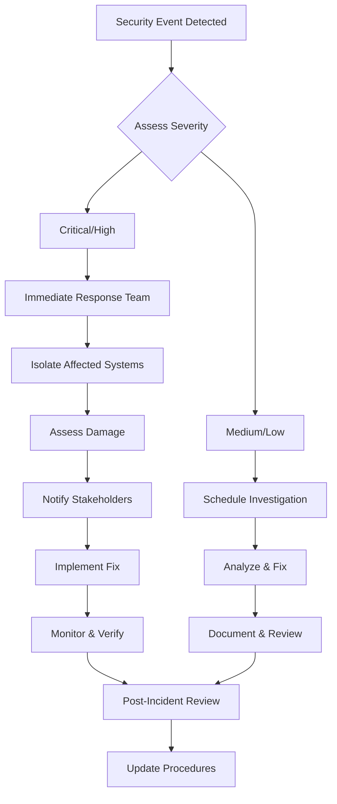

# Security Documentation

## 🔐 Security Overview

LLM-LAB implements multiple layers of security to protect user data, API keys, and system integrity. This document outlines security measures, best practices, and compliance considerations.

## 🛡️ Security Architecture

### **Defense in Depth**

```
┌─────────────────────────────────────┐
│           User Interface            │ ← Input Validation, XSS Protection
├─────────────────────────────────────┤
│          API Gateway/CDN            │ ← Rate Limiting, DDoS Protection
├─────────────────────────────────────┤
│         Load Balancer/Proxy         │ ← SSL Termination, Security Headers
├─────────────────────────────────────┤
│        Application Layer            │ ← Authentication, Authorization
├─────────────────────────────────────┤
│         Business Logic              │ ← Input Sanitization, Validation
├─────────────────────────────────────┤
│          Data Layer                 │ ← Encryption, Access Controls
├─────────────────────────────────────┤
│         Infrastructure              │ ← Network Security, Monitoring
└─────────────────────────────────────┘
```

### **Security Components**

| Component | Purpose | Implementation |
|-----------|---------|----------------|
| **Authentication** | User identity verification | JWT tokens, bcrypt hashing |
| **Authorization** | Access control | Role-based permissions (RBAC) |
| **Input Validation** | Prevent malicious input | joi, express-validator |
| **Rate Limiting** | Prevent abuse | express-rate-limit |
| **Encryption** | Data protection | AES-256, TLS 1.3 |
| **Audit Logging** | Security monitoring | Winston, structured logs |
| **Security Headers** | Browser protection | Helmet.js |

## 🔑 Authentication & Authorization

### **JWT Token Management**

#### **Token Structure**
```javascript
// JWT Payload
{
  "sub": "user_id",           // Subject (user ID)
  "iat": 1703123456,          // Issued at
  "exp": 1703209856,          // Expires
  "aud": "llm-lab",           // Audience
  "iss": "llm-lab-api",       // Issuer
  "scope": ["read", "write"], // Permissions
  "role": "user"              // User role
}
```

#### **Token Security Implementation**
```javascript
// backend/src/utils/jwt.js
const jwt = require('jsonwebtoken');
const crypto = require('crypto');

class JWTManager {
  constructor() {
    this.accessTokenSecret = process.env.JWT_ACCESS_SECRET;
    this.refreshTokenSecret = process.env.JWT_REFRESH_SECRET;
    this.accessTokenExpiry = '15m';
    this.refreshTokenExpiry = '7d';
  }

  generateTokenPair(user) {
    const payload = {
      sub: user.id,
      email: user.email,
      role: user.role,
      scope: this.getUserPermissions(user.role)
    };

    const accessToken = jwt.sign(payload, this.accessTokenSecret, {
      expiresIn: this.accessTokenExpiry,
      issuer: 'llm-lab-api',
      audience: 'llm-lab'
    });

    const refreshToken = jwt.sign(
      { sub: user.id, type: 'refresh' },
      this.refreshTokenSecret,
      { expiresIn: this.refreshTokenExpiry }
    );

    return { accessToken, refreshToken };
  }

  verifyToken(token, type = 'access') {
    const secret = type === 'access' ? this.accessTokenSecret : this.refreshTokenSecret;
    
    try {
      return jwt.verify(token, secret, {
        issuer: 'llm-lab-api',
        audience: 'llm-lab'
      });
    } catch (error) {
      throw new Error(`Invalid ${type} token: ${error.message}`);
    }
  }

  getUserPermissions(role) {
    const permissions = {
      'admin': ['read', 'write', 'delete', 'admin'],
      'user': ['read', 'write'],
      'viewer': ['read']
    };
    return permissions[role] || [];
  }
}

module.exports = new JWTManager();
```

#### **Secure Token Storage**
```javascript
// frontend/src/utils/tokenManager.js
class TokenManager {
  static setTokens(accessToken, refreshToken) {
    // Store access token in memory (most secure)
    this.accessToken = accessToken;
    
    // Store refresh token in httpOnly cookie (secure)
    document.cookie = `refreshToken=${refreshToken}; httpOnly; secure; sameSite=strict; path=/auth`;
  }

  static getAccessToken() {
    return this.accessToken;
  }

  static clearTokens() {
    this.accessToken = null;
    document.cookie = 'refreshToken=; expires=Thu, 01 Jan 1970 00:00:00 UTC; path=/auth;';
  }

  static async refreshAccessToken() {
    const response = await fetch('/api/auth/refresh', {
      method: 'POST',
      credentials: 'include' // Include httpOnly cookies
    });

    if (response.ok) {
      const { accessToken } = await response.json();
      this.accessToken = accessToken;
      return accessToken;
    }
    
    throw new Error('Token refresh failed');
  }
}
```

### **Role-Based Access Control (RBAC)**

#### **Permission System**
```javascript
// backend/src/middleware/authorization.js
const permissions = {
  experiments: {
    create: ['user', 'admin'],
    read: ['user', 'admin', 'viewer'],
    update: ['user', 'admin'],
    delete: ['admin']
  },
  users: {
    create: ['admin'],
    read: ['admin'],
    update: ['admin'],
    delete: ['admin']
  },
  analytics: {
    read: ['user', 'admin'],
    export: ['user', 'admin']
  }
};

const authorize = (resource, action) => {
  return (req, res, next) => {
    const userRole = req.user.role;
    const allowedRoles = permissions[resource]?.[action];

    if (!allowedRoles || !allowedRoles.includes(userRole)) {
      return res.status(403).json({
        success: false,
        error: 'Insufficient permissions',
        required: allowedRoles,
        current: userRole
      });
    }

    next();
  };
};

// Usage in routes
router.delete('/experiments/:id', 
  authenticate,
  authorize('experiments', 'delete'),
  ExperimentController.delete
);
```

#### **Resource-Level Access Control**
```javascript
// backend/src/middleware/resourceAccess.js
const checkResourceOwnership = (resourceType) => {
  return async (req, res, next) => {
    try {
      const resourceId = req.params.id;
      const userId = req.user.id;
      const userRole = req.user.role;

      // Admins can access all resources
      if (userRole === 'admin') {
        return next();
      }

      // Check ownership for regular users
      const resource = await getResource(resourceType, resourceId);
      
      if (!resource) {
        return res.status(404).json({
          success: false,
          error: 'Resource not found'
        });
      }

      if (resource.userId !== userId) {
        return res.status(403).json({
          success: false,
          error: 'Access denied: Not resource owner'
        });
      }

      req.resource = resource;
      next();
    } catch (error) {
      next(error);
    }
  };
};

async function getResource(type, id) {
  const models = {
    experiment: require('../models/Experiment'),
    response: require('../models/Response')
  };
  
  return await models[type]?.findByPk(id);
}
```

## 🔒 Data Protection

### **Encryption at Rest**

#### **Database Encryption**
```javascript
// backend/src/utils/encryption.js
const crypto = require('crypto');

class EncryptionManager {
  constructor() {
    this.algorithm = 'aes-256-gcm';
    this.keyLength = 32;
    this.ivLength = 16;
    this.tagLength = 16;
    this.masterKey = Buffer.from(process.env.ENCRYPTION_KEY, 'hex');
  }

  encrypt(text) {
    if (!text) return null;
    
    const iv = crypto.randomBytes(this.ivLength);
    const cipher = crypto.createCipher(this.algorithm, this.masterKey, { iv });
    
    let encrypted = cipher.update(text, 'utf8', 'hex');
    encrypted += cipher.final('hex');
    
    const tag = cipher.getAuthTag();
    
    return {
      encrypted,
      iv: iv.toString('hex'),
      tag: tag.toString('hex')
    };
  }

  decrypt(encryptedData) {
    if (!encryptedData || !encryptedData.encrypted) return null;
    
    const decipher = crypto.createDecipher(
      this.algorithm,
      this.masterKey,
      { iv: Buffer.from(encryptedData.iv, 'hex') }
    );
    
    decipher.setAuthTag(Buffer.from(encryptedData.tag, 'hex'));
    
    let decrypted = decipher.update(encryptedData.encrypted, 'hex', 'utf8');
    decrypted += decipher.final('utf8');
    
    return decrypted;
  }
}

// Usage in models
const encryptionManager = new EncryptionManager();

// Encrypt sensitive fields before saving
const User = sequelize.define('User', {
  email: DataTypes.STRING,
  apiKeys: {
    type: DataTypes.TEXT,
    get() {
      const raw = this.getDataValue('apiKeys');
      if (!raw) return null;
      return encryptionManager.decrypt(JSON.parse(raw));
    },
    set(value) {
      if (value) {
        const encrypted = encryptionManager.encrypt(JSON.stringify(value));
        this.setDataValue('apiKeys', JSON.stringify(encrypted));
      }
    }
  }
});
```

### **API Key Management**

#### **Secure API Key Storage**
```javascript
// backend/src/services/ApiKeyService.js
const crypto = require('crypto');

class ApiKeyService {
  static async storeApiKey(userId, provider, apiKey) {
    // Hash the API key for verification
    const keyHash = crypto.createHash('sha256').update(apiKey).digest('hex');
    
    // Encrypt the actual key for storage
    const encryptedKey = encryptionManager.encrypt(apiKey);
    
    await ApiKey.create({
      userId,
      provider,
      keyHash,
      encryptedKey: JSON.stringify(encryptedKey),
      createdAt: new Date()
    });
  }

  static async getApiKey(userId, provider) {
    const record = await ApiKey.findOne({
      where: { userId, provider }
    });

    if (!record) {
      throw new Error('API key not found');
    }

    return encryptionManager.decrypt(JSON.parse(record.encryptedKey));
  }

  static async rotateApiKey(userId, provider, newApiKey) {
    const transaction = await sequelize.transaction();
    
    try {
      // Deactivate old key
      await ApiKey.update(
        { status: 'revoked' },
        { where: { userId, provider }, transaction }
      );

      // Store new key
      await this.storeApiKey(userId, provider, newApiKey);
      
      await transaction.commit();
    } catch (error) {
      await transaction.rollback();
      throw error;
    }
  }
}
```

#### **API Key Validation**
```javascript
// backend/src/middleware/apiKeyValidation.js
const validateApiKey = async (req, res, next) => {
  try {
    const { provider } = req.body;
    const userId = req.user.id;

    if (!provider) {
      return res.status(400).json({
        success: false,
        error: 'Provider is required'
      });
    }

    // Check if user has valid API key
    const apiKey = await ApiKeyService.getApiKey(userId, provider);
    
    if (!apiKey) {
      return res.status(400).json({
        success: false,
        error: `No ${provider} API key configured`
      });
    }

    // Validate key format based on provider
    const isValid = await this.validateKeyFormat(provider, apiKey);
    
    if (!isValid) {
      return res.status(400).json({
        success: false,
        error: 'Invalid API key format'
      });
    }

    req.apiKey = apiKey;
    next();
  } catch (error) {
    next(error);
  }
};

const validateKeyFormat = async (provider, apiKey) => {
  const patterns = {
    openai: /^sk-[a-zA-Z0-9]{48}$/,
    anthropic: /^sk-ant-[a-zA-Z0-9-]{95}$/,
    google: /^[a-zA-Z0-9-_]{39}$/
  };

  return patterns[provider]?.test(apiKey) || false;
};
```

### **Data Sanitization**

#### **Input Sanitization**
```javascript
// backend/src/middleware/sanitization.js
const validator = require('validator');
const DOMPurify = require('isomorphic-dompurify');

const sanitizeInput = (req, res, next) => {
  const sanitizeString = (str) => {
    if (typeof str !== 'string') return str;
    
    // Remove potential XSS
    let clean = DOMPurify.sanitize(str);
    
    // Escape HTML entities
    clean = validator.escape(clean);
    
    // Remove potential SQL injection patterns
    clean = clean.replace(/['"\\;]/g, '');
    
    return clean.trim();
  };

  const sanitizeObject = (obj) => {
    if (typeof obj !== 'object' || obj === null) return obj;
    
    const sanitized = {};
    for (const [key, value] of Object.entries(obj)) {
      if (typeof value === 'string') {
        sanitized[key] = sanitizeString(value);
      } else if (typeof value === 'object') {
        sanitized[key] = sanitizeObject(value);
      } else {
        sanitized[key] = value;
      }
    }
    return sanitized;
  };

  // Sanitize request body
  if (req.body) {
    req.body = sanitizeObject(req.body);
  }

  // Sanitize query parameters
  if (req.query) {
    req.query = sanitizeObject(req.query);
  }

  next();
};
```

#### **Output Encoding**
```javascript
// backend/src/utils/responseEncoder.js
const encodeOutput = (data) => {
  if (typeof data === 'string') {
    // Encode special characters for JSON output
    return data
      .replace(/&/g, '&amp;')
      .replace(/</g, '&lt;')
      .replace(/>/g, '&gt;')
      .replace(/"/g, '&quot;')
      .replace(/'/g, '&#x27;');
  }
  
  if (typeof data === 'object' && data !== null) {
    const encoded = {};
    for (const [key, value] of Object.entries(data)) {
      encoded[key] = encodeOutput(value);
    }
    return encoded;
  }
  
  return data;
};

// Middleware to encode all responses
const responseEncoder = (req, res, next) => {
  const originalJson = res.json;
  
  res.json = function(data) {
    const encodedData = encodeOutput(data);
    return originalJson.call(this, encodedData);
  };
  
  next();
};
```

## 🌐 Network Security

### **HTTPS Configuration**

#### **SSL/TLS Setup**
```javascript
// backend/src/server.js
const https = require('https');
const fs = require('fs');

// Production HTTPS server
if (process.env.NODE_ENV === 'production') {
  const options = {
    key: fs.readFileSync(process.env.SSL_KEY_PATH),
    cert: fs.readFileSync(process.env.SSL_CERT_PATH),
    
    // Security settings
    secureProtocol: 'TLSv1_3_method',
    honorCipherOrder: true,
    ciphers: [
      'ECDHE-RSA-AES256-GCM-SHA384',
      'ECDHE-RSA-AES128-GCM-SHA256',
      'ECDHE-RSA-AES256-SHA384',
      'ECDHE-RSA-AES128-SHA256'
    ].join(':')
  };

  const server = https.createServer(options, app);
  server.listen(443, () => {
    console.log('HTTPS Server running on port 443');
  });
  
  // Redirect HTTP to HTTPS
  const http = require('http');
  http.createServer((req, res) => {
    res.writeHead(301, {
      'Location': `https://${req.headers.host}${req.url}`
    });
    res.end();
  }).listen(80);
} else {
  // Development HTTP server
  app.listen(5000, () => {
    console.log('HTTP Server running on port 5000');
  });
}
```

### **Security Headers**

#### **Comprehensive Header Configuration**
```javascript
// backend/src/middleware/securityHeaders.js
const helmet = require('helmet');

const securityHeaders = helmet({
  // Content Security Policy
  contentSecurityPolicy: {
    directives: {
      defaultSrc: ["'self'"],
      styleSrc: ["'self'", "'unsafe-inline'", "https://fonts.googleapis.com"],
      fontSrc: ["'self'", "https://fonts.gstatic.com"],
      scriptSrc: ["'self'"],
      imgSrc: ["'self'", "data:", "https:"],
      connectSrc: [
        "'self'",
        "https://api.openai.com",
        "https://api.anthropic.com",
        process.env.API_BASE_URL
      ],
      frameSrc: ["'none'"],
      objectSrc: ["'none'"],
      baseUri: ["'self'"],
      formAction: ["'self'"]
    },
    reportOnly: false
  },
  
  // HTTP Strict Transport Security
  hsts: {
    maxAge: 31536000,
    includeSubDomains: true,
    preload: true
  },
  
  // X-Frame-Options
  frameguard: {
    action: 'deny'
  },
  
  // X-Content-Type-Options
  noSniff: true,
  
  // X-XSS-Protection
  xssFilter: true,
  
  // Referrer Policy
  referrerPolicy: {
    policy: "strict-origin-when-cross-origin"
  },
  
  // Permissions Policy
  permissionsPolicy: {
    features: {
      camera: [],
      microphone: [],
      geolocation: [],
      payment: []
    }
  }
});

module.exports = securityHeaders;
```

### **Rate Limiting**

#### **Advanced Rate Limiting**
```javascript
// backend/src/middleware/rateLimiting.js
const rateLimit = require('express-rate-limit');
const RedisStore = require('rate-limit-redis');
const redis = require('redis');

const redisClient = redis.createClient(process.env.REDIS_URL);

// General API rate limiting
const apiLimiter = rateLimit({
  store: new RedisStore({
    client: redisClient,
    prefix: 'rl:api:'
  }),
  windowMs: 15 * 60 * 1000, // 15 minutes
  max: 100, // Limit each IP to 100 requests per windowMs
  message: {
    success: false,
    error: 'Too many requests from this IP, please try again later',
    retryAfter: '15 minutes'
  },
  standardHeaders: true,
  legacyHeaders: false,
  skip: (req) => {
    // Skip rate limiting for health checks
    return req.path === '/health';
  }
});

// Strict rate limiting for authentication endpoints
const authLimiter = rateLimit({
  store: new RedisStore({
    client: redisClient,
    prefix: 'rl:auth:'
  }),
  windowMs: 15 * 60 * 1000, // 15 minutes
  max: 5, // Only 5 login attempts per IP per window
  message: {
    success: false,
    error: 'Too many authentication attempts, please try again later',
    retryAfter: '15 minutes'
  },
  skipSuccessfulRequests: true
});

// LLM API rate limiting (more restrictive)
const llmLimiter = rateLimit({
  store: new RedisStore({
    client: redisClient,
    prefix: 'rl:llm:'
  }),
  windowMs: 60 * 1000, // 1 minute
  max: 10, // 10 LLM calls per minute
  message: {
    success: false,
    error: 'LLM API rate limit exceeded, please slow down',
    retryAfter: '1 minute'
  }
});

// Per-user rate limiting
const userLimiter = (maxRequests, windowMs) => {
  return rateLimit({
    store: new RedisStore({
      client: redisClient,
      prefix: 'rl:user:'
    }),
    windowMs,
    max: maxRequests,
    keyGenerator: (req) => req.user?.id || req.ip,
    message: {
      success: false,
      error: 'User rate limit exceeded',
      retryAfter: Math.ceil(windowMs / 1000) + ' seconds'
    }
  });
};

module.exports = {
  apiLimiter,
  authLimiter,
  llmLimiter,
  userLimiter
};
```

## 🚨 Security Monitoring

### **Audit Logging**

#### **Comprehensive Audit System**
```javascript
// backend/src/utils/auditLogger.js
const winston = require('winston');

class AuditLogger {
  constructor() {
    this.logger = winston.createLogger({
      level: 'info',
      format: winston.format.combine(
        winston.format.timestamp(),
        winston.format.json()
      ),
      transports: [
        new winston.transports.File({
          filename: 'logs/audit.log',
          maxsize: 50 * 1024 * 1024, // 50MB
          maxFiles: 30 // Keep 30 days
        }),
        new winston.transports.File({
          filename: 'logs/security.log',
          level: 'warn',
          maxsize: 50 * 1024 * 1024,
          maxFiles: 90 // Keep security logs longer
        })
      ]
    });
  }

  logAuthentication(userId, action, result, metadata = {}) {
    this.logger.info('AUTHENTICATION', {
      userId,
      action, // 'login', 'logout', 'refresh', 'failed_login'
      result, // 'success', 'failure'
      timestamp: new Date().toISOString(),
      ip: metadata.ip,
      userAgent: metadata.userAgent,
      ...metadata
    });
  }

  logDataAccess(userId, resource, action, metadata = {}) {
    this.logger.info('DATA_ACCESS', {
      userId,
      resource, // 'experiment', 'response', 'user'
      action, // 'create', 'read', 'update', 'delete'
      timestamp: new Date().toISOString(),
      resourceId: metadata.resourceId,
      ...metadata
    });
  }

  logSecurityEvent(event, severity, metadata = {}) {
    const logLevel = severity === 'high' ? 'error' : 'warn';
    
    this.logger[logLevel]('SECURITY_EVENT', {
      event, // 'suspicious_activity', 'rate_limit_exceeded', 'invalid_token'
      severity, // 'low', 'medium', 'high', 'critical'
      timestamp: new Date().toISOString(),
      ...metadata
    });
  }

  logApiKeyUsage(userId, provider, usage, metadata = {}) {
    this.logger.info('API_KEY_USAGE', {
      userId,
      provider,
      usage, // 'request', 'error', 'rate_limited'
      timestamp: new Date().toISOString(),
      ...metadata
    });
  }
}

module.exports = new AuditLogger();
```

#### **Audit Middleware**
```javascript
// backend/src/middleware/auditMiddleware.js
const auditLogger = require('../utils/auditLogger');

const auditMiddleware = (req, res, next) => {
  const startTime = Date.now();
  
  // Capture original res.json to log responses
  const originalJson = res.json;
  res.json = function(data) {
    const responseTime = Date.now() - startTime;
    
    // Log data access
    if (req.user) {
      const action = getActionFromMethod(req.method);
      const resource = getResourceFromPath(req.path);
      
      auditLogger.logDataAccess(req.user.id, resource, action, {
        ip: req.ip,
        userAgent: req.get('User-Agent'),
        responseTime,
        statusCode: res.statusCode,
        path: req.path
      });
    }
    
    return originalJson.call(this, data);
  };
  
  next();
};

function getActionFromMethod(method) {
  const actions = {
    'GET': 'read',
    'POST': 'create',
    'PUT': 'update',
    'PATCH': 'update',
    'DELETE': 'delete'
  };
  return actions[method] || 'unknown';
}

function getResourceFromPath(path) {
  const pathParts = path.split('/');
  return pathParts[2] || 'unknown'; // /api/experiments -> experiments
}
```

### **Intrusion Detection**

#### **Suspicious Activity Detection**
```javascript
// backend/src/services/SecurityMonitoringService.js
class SecurityMonitoringService {
  constructor() {
    this.suspiciousPatterns = [
      /union\s+select/i,         // SQL injection
      /<script/i,                // XSS attempts
      /\.\.\//,                  // Path traversal
      /eval\s*\(/i,             // Code injection
      /document\.cookie/i,       // Cookie theft attempts
      /javascript:/i             // JavaScript protocol
    ];
    
    this.failedAttempts = new Map(); // IP -> { count, firstAttempt, lastAttempt }
  }

  checkSuspiciousActivity(req) {
    const ip = req.ip;
    const userAgent = req.get('User-Agent') || '';
    const path = req.path;
    const body = JSON.stringify(req.body || {});
    const query = JSON.stringify(req.query || {});

    // Check for malicious patterns
    const allInput = `${path} ${body} ${query} ${userAgent}`;
    for (const pattern of this.suspiciousPatterns) {
      if (pattern.test(allInput)) {
        this.reportSuspiciousActivity(ip, 'malicious_pattern', {
          pattern: pattern.toString(),
          input: allInput.substring(0, 500), // Truncate for logging
          userAgent,
          path
        });
        return true;
      }
    }

    // Check for brute force attempts
    if (this.isBruteForceAttempt(ip)) {
      this.reportSuspiciousActivity(ip, 'brute_force', {
        attempts: this.failedAttempts.get(ip)?.count || 0,
        userAgent,
        path
      });
      return true;
    }

    return false;
  }

  recordFailedAttempt(ip) {
    const now = Date.now();
    const existing = this.failedAttempts.get(ip);
    
    if (existing) {
      existing.count++;
      existing.lastAttempt = now;
    } else {
      this.failedAttempts.set(ip, {
        count: 1,
        firstAttempt: now,
        lastAttempt: now
      });
    }

    // Clean up old entries (older than 1 hour)
    this.cleanupOldAttempts();
  }

  isBruteForceAttempt(ip) {
    const attempts = this.failedAttempts.get(ip);
    if (!attempts) return false;

    const timeWindow = 15 * 60 * 1000; // 15 minutes
    const maxAttempts = 10;
    
    return attempts.count >= maxAttempts && 
           (Date.now() - attempts.firstAttempt) <= timeWindow;
  }

  reportSuspiciousActivity(ip, type, metadata) {
    auditLogger.logSecurityEvent('suspicious_activity', 'medium', {
      ip,
      type,
      ...metadata
    });

    // Block IP if necessary
    if (type === 'brute_force' || metadata.pattern) {
      this.blockIP(ip, '1 hour');
    }
  }

  blockIP(ip, duration) {
    // Implementation depends on your infrastructure
    // Could use fail2ban, iptables, cloud provider APIs, etc.
    console.warn(`Blocking IP ${ip} for ${duration}`);
  }

  cleanupOldAttempts() {
    const oneHourAgo = Date.now() - (60 * 60 * 1000);
    
    for (const [ip, attempts] of this.failedAttempts.entries()) {
      if (attempts.lastAttempt < oneHourAgo) {
        this.failedAttempts.delete(ip);
      }
    }
  }
}

module.exports = new SecurityMonitoringService();
```

## 🔐 Security Best Practices

### **Code Security**

#### **Secure Coding Checklist**

```markdown
## Input Validation
- [ ] All user inputs are validated and sanitized
- [ ] SQL injection protection (parameterized queries)
- [ ] XSS prevention (output encoding)
- [ ] Path traversal prevention
- [ ] File upload restrictions (type, size, content)
- [ ] JSON payload size limits

## Authentication & Authorization
- [ ] Strong password requirements
- [ ] Account lockout after failed attempts
- [ ] Session timeout implementation
- [ ] Secure session management
- [ ] Multi-factor authentication (future enhancement)
- [ ] Permission checks on all endpoints

## Data Protection
- [ ] Sensitive data encryption at rest
- [ ] Secure transmission (HTTPS)
- [ ] API key rotation procedures
- [ ] Data retention policies
- [ ] Secure data disposal

## Infrastructure Security
- [ ] Regular security updates
- [ ] Secure configuration management
- [ ] Network segmentation
- [ ] Monitoring and alerting
- [ ] Backup security
- [ ] Incident response procedures
```

#### **Security Testing**

```javascript
// tests/security/security.test.js
const request = require('supertest');
const app = require('../../src/app');

describe('Security Tests', () => {
  describe('SQL Injection Protection', () => {
    it('should reject malicious SQL in experiment name', async () => {
      const maliciousInput = "'; DROP TABLE experiments; --";
      
      const response = await request(app)
        .post('/api/experiments')
        .set('Authorization', 'Bearer valid-token')
        .send({ name: maliciousInput })
        .expect(400);
        
      expect(response.body.error).toContain('Invalid input');
    });
  });

  describe('XSS Protection', () => {
    it('should sanitize script tags in input', async () => {
      const xssInput = '<script>alert("xss")</script>';
      
      const response = await request(app)
        .post('/api/experiments')
        .set('Authorization', 'Bearer valid-token')
        .send({ description: xssInput })
        .expect(201);
        
      expect(response.body.data.description).not.toContain('<script>');
    });
  });

  describe('Rate Limiting', () => {
    it('should block after too many requests', async () => {
      const requests = Array(101).fill().map(() =>
        request(app).get('/api/experiments')
      );
      
      const responses = await Promise.all(requests);
      const rateLimitedResponses = responses.filter(r => r.status === 429);
      
      expect(rateLimitedResponses.length).toBeGreaterThan(0);
    });
  });

  describe('Authentication', () => {
    it('should reject invalid JWT tokens', async () => {
      await request(app)
        .get('/api/experiments')
        .set('Authorization', 'Bearer invalid-token')
        .expect(401);
    });

    it('should reject expired JWT tokens', async () => {
      const expiredToken = generateExpiredToken();
      
      await request(app)
        .get('/api/experiments')
        .set('Authorization', `Bearer ${expiredToken}`)
        .expect(401);
    });
  });
});
```

### **Deployment Security**

#### **Production Security Checklist**

```markdown
## Environment Configuration
- [ ] All secrets in environment variables (not code)
- [ ] Strong, unique JWT secrets
- [ ] Database credentials secured
- [ ] API keys properly managed
- [ ] Debug mode disabled
- [ ] Error messages don't leak sensitive info

## Network Security
- [ ] HTTPS enforced (redirect HTTP)
- [ ] Security headers configured
- [ ] CORS properly configured
- [ ] Rate limiting enabled
- [ ] DDoS protection active
- [ ] Firewall rules configured

## Infrastructure Security
- [ ] Regular OS and dependency updates
- [ ] Monitoring and alerting configured
- [ ] Log aggregation and analysis
- [ ] Backup and recovery procedures
- [ ] Incident response plan
- [ ] Security scanning automated

## Compliance
- [ ] Data retention policies documented
- [ ] Privacy policy updated
- [ ] User consent mechanisms
- [ ] Data export/deletion capabilities
- [ ] Security audit trail maintained
```

#### **Environment Security**

```bash
# Production environment security
# Set restrictive file permissions
chmod 600 .env
chmod 700 logs/

# Secure file ownership
chown app:app /app
chown app:app /app/.env

# Remove development tools in production
npm prune --production

# Set security-focused environment variables
export NODE_ENV=production
export NPM_CONFIG_PRODUCTION=true
export NODE_OPTIONS="--max-old-space-size=1024"

# Disable Node.js debug features
unset NODE_DEBUG
unset DEBUG
```

## 📋 Incident Response

### **Security Incident Procedures**

#### **Incident Classification**

| Severity | Examples | Response Time | Actions |
|----------|----------|---------------|---------|
| **Critical** | Data breach, system compromise | Immediate | Stop attack, assess damage, notify users |
| **High** | Authentication bypass, privilege escalation | 2 hours | Investigate, patch, monitor |
| **Medium** | XSS, CSRF, information disclosure | 24 hours | Fix vulnerability, review logs |
| **Low** | Configuration issues, minor exposures | 72 hours | Schedule fix, document |

#### **Response Workflow**



#### **Contact Information**

```yaml
# Emergency Contacts
Security Team Lead: security-lead@company.com
CTO: cto@company.com
Legal: legal@company.com
PR: communications@company.com

# External Contacts
Hosting Provider: support@hosting-provider.com
Security Firm: incident@security-firm.com
Law Enforcement: cybercrimes@law-enforcement.gov
```

## 📚 Security Resources

### **Security Training**

- **OWASP Top 10**: https://owasp.org/www-project-top-ten/
- **Node.js Security**: https://nodejs.org/en/security/
- **JWT Security**: https://auth0.com/blog/a-look-at-the-latest-draft-for-jwt-bcp/
- **React Security**: https://blog.logrocket.com/security-react-app/

### **Security Tools**

```bash
# Static analysis
npm install -g eslint-plugin-security
npm audit

# Dependency scanning
npm install -g snyk
snyk test

# Container scanning
docker run --rm -v /var/run/docker.sock:/var/run/docker.sock \
  -v $(pwd):/app aquasec/trivy image llm-lab:latest

# Code analysis
npm install -g semgrep
semgrep --config=auto .
```

---

**Security is everyone's responsibility. Stay vigilant, follow best practices, and report any concerns immediately! 🔒**
