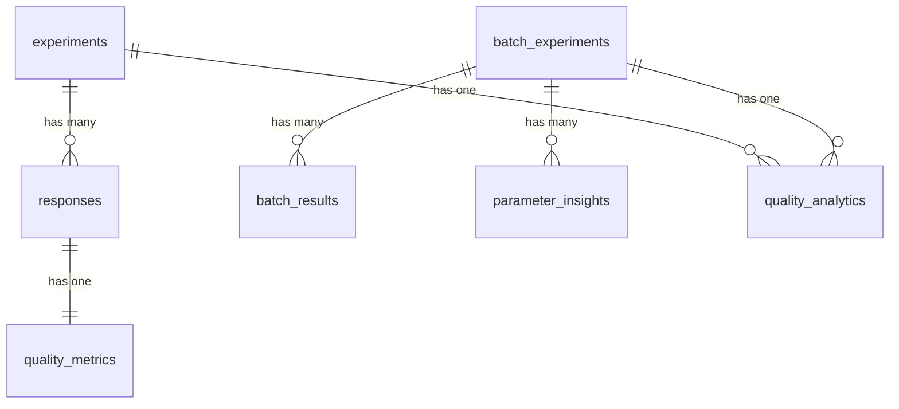
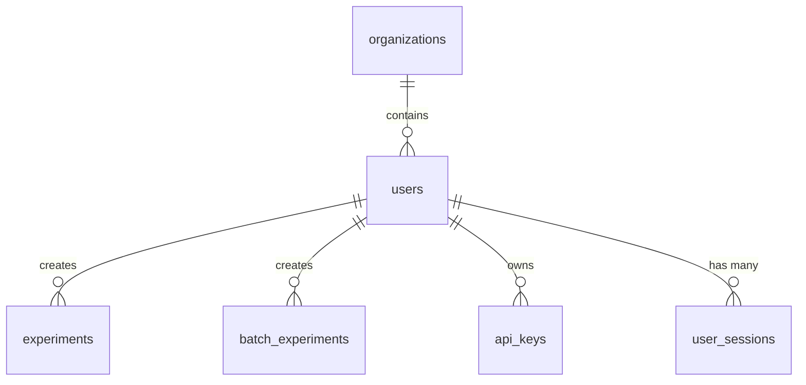
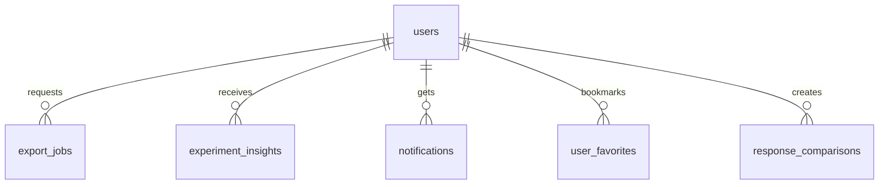

# Database Migration Guide

## 📋 Overview

This document provides a comprehensive guide for applying database migrations to support all LLM-LAB backend API features. The migrations are designed to be applied sequentially and are safe for both fresh installations and existing databases.

## 🗃️ Migration Files

### **Migration Sequence**

| Migration | File | Description | Dependencies |
|-----------|------|-------------|--------------|
| **001** | `001_batch_experiments_complete.sql` | Core schema with batch experiments | None |
| **002** | `002_authentication_and_user_management.sql` | User auth & multi-tenancy | 001 |
| **003** | `003_advanced_features_and_analytics.sql` | Analytics & export features | 001, 002 |
| **004** | `004_production_optimizations.sql` | Production performance & security | All previous |

### **Migration 001: Core Schema**
- **Purpose**: Establishes base tables for experiments, responses, and quality metrics
- **Features**: Single & batch experiments, quality analytics, parameter insights
- **Tables Created**: 8 core tables
- **Safe to run**: ✅ Multiple times (idempotent)

### **Migration 002: Authentication & User Management**
- **Purpose**: Adds user authentication, authorization, and multi-tenancy
- **Features**: JWT auth, RBAC, API key management, organizations
- **Tables Created**: 8 user management tables
- **Updates**: Adds user_id and organization_id to existing tables

### **Migration 003: Advanced Features**
- **Purpose**: Export functionality, advanced analytics, notifications
- **Features**: PDF/CSV exports, AI insights, comparison tools, alerts
- **Tables Created**: 11 advanced feature tables
- **Enhancements**: Quality metrics, trending, favorites

### **Migration 004: Production Optimizations**
- **Purpose**: Performance, security, and monitoring for production
- **Features**: Rate limiting, caching, audit logs, business metrics
- **Tables Created**: 12 production tables
- **Optimizations**: Indexes, constraints, cleanup procedures

## 🚀 Quick Start

### **For Fresh Installation**
```sql
-- Run all migrations in sequence
-- 1. Execute in SQL Server Management Studio or Azure Data Studio
sqlcmd -S your-server -d your-database -i "001_batch_experiments_complete.sql"
sqlcmd -S your-server -d your-database -i "002_authentication_and_user_management.sql"
sqlcmd -S your-server -d your-database -i "003_advanced_features_and_analytics.sql"
sqlcmd -S your-server -d your-database -i "004_production_optimizations.sql"

-- 2. Or run through Azure Data Studio / SSMS
-- Execute each file in order
```

### **For Existing Database**
```sql
-- Check current migration status
SELECT version, applied_at FROM schema_migrations ORDER BY applied_at;

-- Apply missing migrations based on what's not in the results
-- All migrations are safe to re-run (idempotent)
```

## 📊 Database Schema Overview

### **Core Tables (Migration 001)**



### **User Management (Migration 002)**



### **Advanced Features (Migration 003)**



## 🔧 Detailed Migration Instructions

### **Pre-Migration Checklist**

- [ ] **Backup database** before applying migrations
- [ ] **Test on staging** environment first
- [ ] **Check disk space** (migrations add indexes and new tables)
- [ ] **Verify permissions** (CREATE TABLE, CREATE INDEX, CREATE TRIGGER)
- [ ] **Review connection limits** during migration

### **Step-by-Step Application**

#### **Step 1: Prepare Environment**
```sql
-- Check current database status
SELECT 
    name,
    compatibility_level,
    collation_name,
    state_desc
FROM sys.databases 
WHERE name = 'your_llm_lab_database';

-- Ensure adequate space
EXEC sp_spaceused;
```

#### **Step 2: Apply Migration 001**
```sql
-- Execute 001_batch_experiments_complete.sql
-- This creates the foundation schema
-- Duration: ~2-5 minutes depending on server
-- Tables created: 8
-- Indexes created: 15+
-- Triggers created: 3
```

**Expected Output:**
```
Created table: experiments
Created table: responses
Created table: quality_metrics
...
Migration 001_batch_experiments_complete - ALL TABLES CREATED successfully
```

#### **Step 3: Apply Migration 002**
```sql
-- Execute 002_authentication_and_user_management.sql
-- Adds user management and security
-- Duration: ~3-7 minutes
-- Tables created: 8
-- Columns added to existing tables: 6
-- Foreign keys added: 6
```

**Expected Output:**
```
Created table: users
Created table: organizations
...
Added user_id column to experiments table
Migration 002_authentication_and_user_management - COMPLETED successfully
```

#### **Step 4: Apply Migration 003**
```sql
-- Execute 003_advanced_features_and_analytics.sql
-- Adds advanced features and analytics
-- Duration: ~4-8 minutes
-- Tables created: 11
-- Stored procedures: 1
-- Views created: 1
```

#### **Step 5: Apply Migration 004**
```sql
-- Execute 004_production_optimizations.sql
-- Production performance and security
-- Duration: ~5-10 minutes
-- Tables created: 12
-- Stored procedures: 2
-- Performance optimizations applied
```

### **Post-Migration Verification**

```sql
-- 1. Verify all tables exist
SELECT 
    TABLE_NAME,
    TABLE_TYPE
FROM INFORMATION_SCHEMA.TABLES 
WHERE TABLE_SCHEMA = 'dbo'
ORDER BY TABLE_NAME;

-- 2. Check migration status
SELECT version, applied_at FROM schema_migrations ORDER BY applied_at;

-- 3. Verify sample data
SELECT COUNT(*) as user_count FROM users;
SELECT COUNT(*) as model_count FROM llm_models;
SELECT COUNT(*) as setting_count FROM system_settings;

-- 4. Test basic functionality
SELECT TOP 5 * FROM experiments;
SELECT TOP 5 * FROM quality_metrics;
```

## 🔍 Troubleshooting

### **Common Issues**

#### **Issue: "Table already exists" errors**
```sql
-- Solution: This is expected behavior - migrations are idempotent
-- The message indicates the table already exists and was skipped
-- This is normal and safe
```

#### **Issue: Foreign key constraint errors**
```sql
-- Check for orphaned records
SELECT e.id, e.user_id 
FROM experiments e 
LEFT JOIN users u ON e.user_id = u.id 
WHERE e.user_id IS NOT NULL AND u.id IS NULL;

-- Clean up orphaned records if needed
UPDATE experiments SET user_id = NULL WHERE user_id NOT IN (SELECT id FROM users);
```

#### **Issue: Insufficient permissions**
```sql
-- Required permissions for migration user:
-- CREATE TABLE, CREATE INDEX, CREATE PROCEDURE, CREATE TRIGGER
-- ALTER TABLE, INSERT, UPDATE, DELETE, SELECT

-- Grant permissions example:
GRANT CREATE TABLE TO migration_user;
GRANT ALTER ON SCHEMA::dbo TO migration_user;
```

#### **Issue: Timeout during migration**
```sql
-- Increase command timeout in your client
-- For sqlcmd: use -t parameter
sqlcmd -S server -d database -t 300 -i migration.sql

-- For large databases, consider running in smaller batches
```

### **Performance Considerations**

#### **During Migration**
- **Expect 10-30 minutes** total for all migrations on average databases
- **Index creation** takes the longest time
- **Trigger creation** is usually fast
- **Sample data insertion** is minimal

#### **After Migration**
- **Update statistics** for better performance:
```sql
UPDATE STATISTICS experiments;
UPDATE STATISTICS responses;
UPDATE STATISTICS quality_metrics;
UPDATE STATISTICS users;
```

- **Monitor query performance**:
```sql
-- Enable query performance monitoring
INSERT INTO system_settings (setting_key, setting_value, setting_type) 
VALUES ('query_monitoring_enabled', 'true', 'boolean');
```

## 📈 Monitoring Migration Success

### **Health Check Queries**

```sql
-- 1. Table count verification
SELECT 
    'Expected: 39 tables' as note,
    COUNT(*) as actual_table_count
FROM INFORMATION_SCHEMA.TABLES 
WHERE TABLE_SCHEMA = 'dbo' AND TABLE_TYPE = 'BASE TABLE';

-- 2. Index verification
SELECT 
    COUNT(*) as index_count,
    COUNT(CASE WHEN is_unique = 1 THEN 1 END) as unique_indexes
FROM sys.indexes 
WHERE object_id IN (
    SELECT object_id FROM sys.tables WHERE schema_id = SCHEMA_ID('dbo')
);

-- 3. Foreign key verification
SELECT COUNT(*) as foreign_key_count FROM sys.foreign_keys;

-- 4. Trigger verification
SELECT COUNT(*) as trigger_count FROM sys.triggers WHERE parent_class = 1;

-- 5. Stored procedure verification
SELECT COUNT(*) as procedure_count FROM sys.procedures WHERE schema_id = SCHEMA_ID('dbo');
```

### **Expected Counts After All Migrations**

| Component | Expected Count |
|-----------|----------------|
| **Tables** | 39 |
| **Indexes** | 80+ |
| **Foreign Keys** | 25+ |
| **Triggers** | 5+ |
| **Stored Procedures** | 3+ |
| **Views** | 3+ |

## 🛡️ Security Considerations

### **Migration User Permissions**
```sql
-- Create dedicated migration user with minimal required permissions
CREATE LOGIN llm_lab_migration WITH PASSWORD = 'SecurePassword123!';
CREATE USER llm_lab_migration FOR LOGIN llm_lab_migration;

-- Grant only necessary permissions
GRANT CREATE TABLE, CREATE INDEX, CREATE PROCEDURE TO llm_lab_migration;
GRANT ALTER ON SCHEMA::dbo TO llm_lab_migration;
GRANT INSERT, UPDATE, DELETE, SELECT ON SCHEMA::dbo TO llm_lab_migration;
```

### **Data Protection**
- All API keys are **encrypted at rest**
- User passwords are **bcrypt hashed**
- Audit logging tracks **all data access**
- IP access control for **network security**

## 📝 Migration Rollback

### **Emergency Rollback Procedure**

```sql
-- 1. Restore from backup (recommended)
RESTORE DATABASE llm_lab_database 
FROM DISK = 'path/to/backup.bak' 
WITH REPLACE;

-- 2. Manual rollback (if backup not available)
-- Drop tables in reverse dependency order
-- Note: This will lose all data in new tables!

-- Drop Migration 004 tables
DROP TABLE IF EXISTS custom_quality_metrics;
DROP TABLE IF EXISTS quality_metric_weights;
-- ... (continue with all Migration 004 tables)

-- Drop Migration 003 tables
DROP TABLE IF EXISTS feature_flags;
DROP TABLE IF EXISTS system_settings;
-- ... (continue with all Migration 003 tables)

-- And so on...
```

## 📊 Performance Benchmarks

### **Migration Times (Typical)**

| Migration | Empty DB | Small DB (1K records) | Large DB (100K records) |
|-----------|----------|----------------------|------------------------|
| **001** | 2 min | 3 min | 8 min |
| **002** | 3 min | 4 min | 12 min |
| **003** | 4 min | 6 min | 15 min |
| **004** | 5 min | 8 min | 20 min |
| **Total** | 14 min | 21 min | 55 min |

### **Post-Migration Performance**

```sql
-- Test query performance after migration
SET STATISTICS TIME ON;
SET STATISTICS IO ON;

-- Test experiment queries
SELECT TOP 100 * FROM experiments WHERE status = 'completed';

-- Test join performance
SELECT e.name, u.email, AVG(qm.overall_score)
FROM experiments e
JOIN users u ON e.user_id = u.id
JOIN responses r ON e.id = r.experiment_id
JOIN quality_metrics qm ON r.id = qm.response_id
GROUP BY e.name, u.email;

SET STATISTICS TIME OFF;
SET STATISTICS IO OFF;
```

## 🎯 Next Steps After Migration

1. **Configure API Keys** for LLM providers
2. **Set up User Authentication** in your application
3. **Configure Rate Limiting** based on your needs
4. **Set up Monitoring** and alerting
5. **Configure Backup Strategy** for production
6. **Test All API Endpoints** with the new schema
7. **Run Performance Tests** under load

## 📞 Support

If you encounter issues during migration:

1. **Check the troubleshooting section** above
2. **Review SQL Server error logs**
3. **Verify prerequisites** and permissions
4. **Test on a smaller dataset** first
5. **Contact the development team** with specific error messages

---

**Migration completed successfully! Your LLM-LAB database is now ready to support all backend API features. 🚀**
